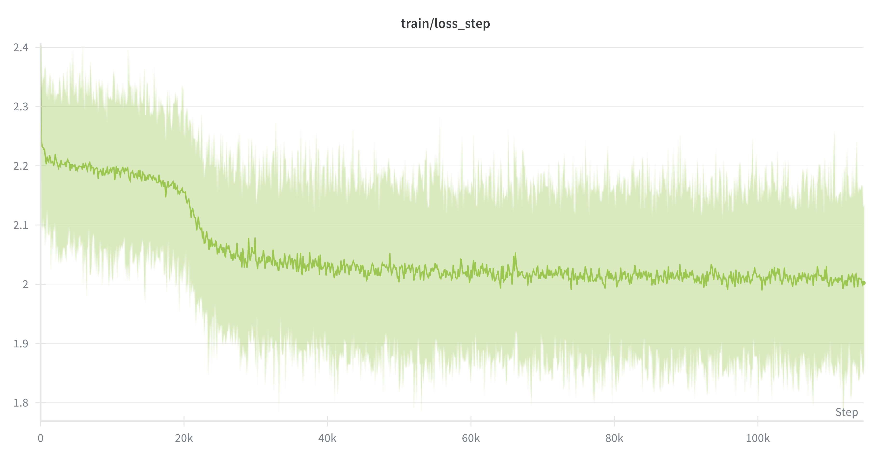

# RANKING MODEL TRAINING PART

## FEATURES:

- Fielded BM25 score (2.0 weight on title, 1.0 weight on body)
- BM25 score body
- BM25 score title
- First occurrence of each query token in body (MEAN)
- First occurrence of each query token in title (MEAN)
- First occurrence of each query token in body (MIN of all query tokens)
- First occurrence of each query token in title (MIN of all query tokens)
- Normalized body length (MAX normalized)
- Normalized title length (MAX normalized)
- If any query tokens are present in title (1 if present, 0 otherwise)

## LOSS CURVES:

## VALIDATION METRICS:

## TEST METRICS:

| Metric | Value  |
| ------ | ------ |
| MRR    | 0.6761 |
| NDCG   | 0.7342 |

## DEV METRICS:

| Metric | Value  |
| ------ | ------ |
| MRR    | 0.3921 |
| NDCG   | 0.4879 |
